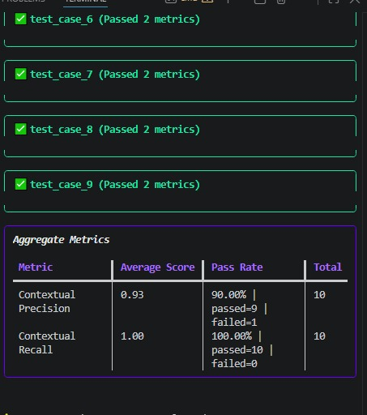
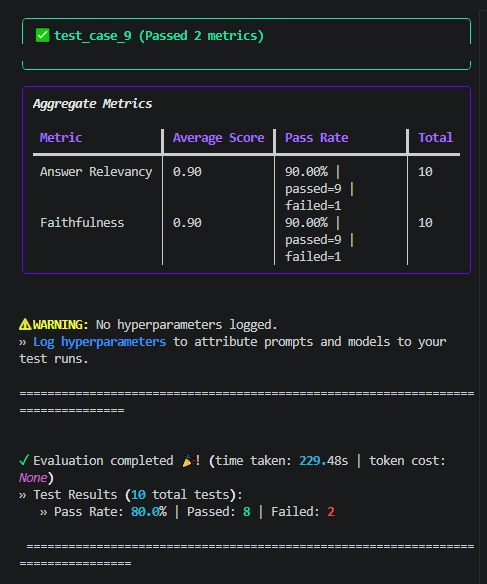
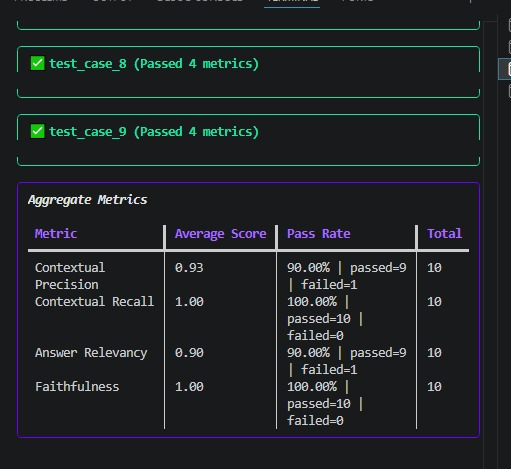

<div align="center">

# 🔍 RAG Evaluation Pipeline

**Component-level and pipeline-level evaluation of a Retrieval-Augmented Generation (RAG) system**
Built with [DeepEval](https://github.com/confident-ai/deepeval) and Groq.


</div>

---

## 📖 What This Is

A RAG system has two moving parts:

- a **retriever** that fetches relevant context
- a **generator** that writes the final answer

If you only test the whole pipeline end-to-end, you can't tell *which* part is broken when something goes wrong.

This project tests all three levels **separately**, on the same golden dataset:

```
┌─────────────┐        ┌─────────────┐
│  RETRIEVER  │  ───▶  │  GENERATOR  │  ───▶  Final Answer
└─────────────┘        └─────────────┘
      │                       │
      ▼                       ▼
 Precision/Recall      Relevancy/Faithfulness
      │                       │
      └───────────┬───────────┘
                   ▼
         Full Pipeline (RAG Triad)
```

A sample company policy document (`.docx`) is chunked and stored in a vector DB, and a **10-question golden dataset** drives every evaluation run.

---

## 🧩 Project Structure

```
rag_eval/
├── data/                   # Source document + golden dataset
├── shared/                 # Retriever, generator, chunking, Groq judge
├── eval_retriever/         # Retriever-only evaluation
├── eval_generator/         # Generator-only evaluation
├── eval_pipeline/          # Full end-to-end evaluation
└── screenshots/            # Evaluation run results
```

---

## 1️⃣ Retriever Evaluation

Tests whether the retriever pulls the **right chunks**, in the **right order** — independent of any generation step.

| Metric | What It Checks |
|:--|:--|
| **Contextual Precision** | Are the relevant chunks ranked at the top? |
| **Contextual Recall** | Are *all* the facts needed to answer present somewhere in the retrieved chunks? |

<p align="center">
  
</p>

---

## 2️⃣ Generator Evaluation

Feeds the retriever's chunks into an LLM and checks whether the **generated answer** is any good — assuming retrieval is fixed.

| Metric | What It Checks |
|:--|:--|
| **Answer Relevancy** | Does the answer actually address the question? |
| **Faithfulness** | Is the answer grounded in the retrieved context, or hallucinated? |

<p align="center">
  
</p>

---

## 3️⃣ Full Pipeline Evaluation (RAG Triad)

All four metrics run together on the same test case — the real, end-to-end user experience.

<p align="center">
  
</p>

---

## 🛠️ Debugging With the System Prompt

The first pipeline run surfaced 3 failing test cases. Reading each `reason` from DeepEval made the diagnosis easy:

| Failure | Root Cause | Fixable via Prompt? |
|:--|:--|:--:|
| Low Contextual Precision | Retriever ranked an irrelevant chunk above the relevant one | ❌ No — retriever/chunking issue |
| Low Answer Relevancy | Generator said *"not found"* even though the answer was present, just paraphrased differently | ✅ Yes |
| Low Faithfulness | Generator's answer format was ambiguous when listing multiple items | ✅ Yes |

The generator's system prompt was updated to:

- Look for **paraphrased or indirect matches**, not just literal keyword overlap, before saying information is missing
- Always label **each item clearly** when listing multiple things, instead of a bare comma-separated list

### 📊 Result After the Fix

| Metric | Before | After |
|:--|:--:|:--:|
| Answer Relevancy | 0.80 | **0.90** ✅ |
| Faithfulness | 0.90 | **1.00** ✅ |
| Contextual Precision / Recall | unchanged | unchanged *(expected — prompt changes don't touch retrieval)* |

> **Core lesson:** retriever problems and generator problems need different fixes — RAG evaluation done in layers is what tells you which one you're looking at.

---

## ⚙️ Tech Stack

| Component | Tool |
|:--|:--|
| Evaluation metrics & orchestration | **DeepEval** |
| Vector store & embeddings | **ChromaDB** + `sentence-transformers` |
| Generator & judge LLM | **Groq** (`openai/gpt-oss-20b`) |
| Text splitting & Groq integration | **LangChain** |
| Source document parsing | **python-docx** |

---

## ▶️ Running It

```bash
python -m venv venv && venv\Scripts\activate       # Windows

pip install -r requirements.txt

# add your GROQ_API_KEY to a .env file (see .env.example)

python shared/chunk_and_store.py            # index the document once

python eval_retriever/evaluate_retriever.py
python eval_generator/evaluate_generator.py
python eval_pipeline/evaluate_pipeline.py
```

---

## 🎯 Next Up: Application-Level Evaluation

Component and pipeline evaluation answer *"is this technically accurate?"*. The next phase moves up a level to *"is this safe and production-ready?"*

- **Custom business-rule checks** with `GEval` (e.g. tone compliance, correct escalation language)
- **Safety metrics** — toxicity, bias, PII leakage
- **Operational checks** — latency, cost per query

Stay tuned. 🚀